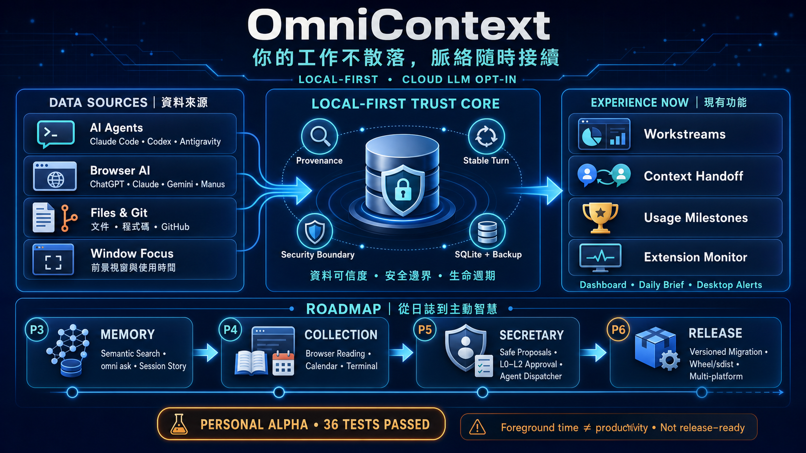

# 🌐 OmniContext — 個人全景活動追蹤與進行中工作智慧中樞

[](#-language--%E8%AA%9E%E8%A8%80)
[](LICENSE)
[](https://www.python.org/)
[](https://fastapi.tiangolo.com/)

> **[English Documentation](README_en.md) | [繁體中文說明文件](README.md)**

> **目前狀態：Personal Alpha。** Windows milestone WinRT Toast E2E、schema 13/13、formal package+DB rollback、P3-2～P3-5、P5-1 proposal-only、collector runtime diagnostics、P2.6 continuous coverage ledger 與跨平台 CI 已通過；**Extension 1.3.1 已於 2026-08-31 在已登入 Chrome 取得 ChatGPT＋Claude.ai 本輪 live PASS receipt（heartbeat 已驗證）；P2.7 三平台背景任務 live 驗收（codex／claude_code／claude_desktop）亦已全數 PASS**。剩餘缺口：全天 coverage ledger 實測與正式 tag／發佈，因此尚非 release-ready。

**文件入口：**[📚 文件總覽](docs/INDEX.md) · [完整使用說明](docs/USAGE.md) · [開發規劃](ROADMAP.md) · [目前狀態](STATUS.yaml) · [測試策略](docs/TEST_STRATEGY.md)



**OmniContext** 是一個**本機優先（Local-First）、具有明確資料邊界**的個人上下文記憶中樞與工作進度追蹤系統。它能捕獲跨平台 AI 對話（Claude Code、Codex、Antigravity、ChatGPT、Gemini 等）、程式碼提交、檔案與論文寫作異動、視窗時間分配，並整合 GitHub 雲端倉庫與 Pull Request (PR) 狀態。

它與單一 AI 的 memory／chat import 不同：**OmniContext 的 canonical context 屬於使用者與專案，不屬於任何一家 AI provider。** 除了多個 AI 的對話與工作狀態，也把 local Repository、branch/commit、檔案異動、IDE/terminal、foreground activity 與 Open Loops 納入同一條可追溯時間線，再產生 provider-neutral Context Handoff。完整定位與證據邊界見[產品定位](docs/PRODUCT_POSITIONING.md)。

隨時幫助您回答三個核心問題：
1. **「我現在正在進行哪些專案？」**
2. **「我上次做到哪裡、動了哪些檔案？」**
3. **「有哪些尚未收尾的未結事項（Open Loops）？」**

---

## 🌟 核心特色功能

```
┌──────────────────────────────────────────────────────────────────────────┐
│                        OmniContext 核心系統架構                          │
├──────────────────────────────────────────────────────────────────────────┤
│                                                                          │
│  [ 跨平台 AI 採集 ]      [ 本機檔案 / Git ]      [ GitHub 雲端整合 ]     │
│  • Claude Code 日誌       • Watchdog 檔案異動     • 48+ Public/Private   │
│  • Codex Sessions         • 遞迴 Git Scanner      • PR 狀態 / 分支流向   │
│  • Antigravity 對話       • 論文多檔案智能歸戶    • Actions CI 測試結果  │
│  • Chrome 擴充套件                                                       │
│          │                       │                       │               │
│          └───────────────────────┼───────────────────────┘               │
│                                  ▼                                       │
│                    [ 本機 SQLite 資料庫儲存 ]                            │
│             (omni_context.db · 本機儲存；cloud LLM 為 opt-in)            │
│                                  │                                       │
│          ┌───────────────────────┼───────────────────────┐               │
│          ▼                       ▼                       ▼               │
│  [ Web 視覺化儀表板 ]    [ DeskRAG 知識庫 ]      [ AI 摘要與主動提醒 ]   │
│  • 01 · 進行中工作       • PDF/Office/Md 解析    • 多日自訂區間日報回顧  │
│  • 02 · 即時情報流       • FastEmbed + ChromaDB  • 週期性 Checkpoint     │
│  • 03 · 知識庫與 RAG     • Jieba + BM25 關鍵字   • 桌面通知 / Telegram   │
│  • 04 · 監控配置         • Hybrid RRF 混合檢索   • 多供應商 (Gemini /    │
│  • 05 · 每日摘要         • 多模型 SSE 串流問答     Claude/OpenAI/Ollama) │
│  • 06 · 活動快照         • 檔案總管精準定位                              │
│  • 07 · 系統健康與維護 · 🌐 中英文 i18n 動態切換 / 深淺色主題            │
└──────────────────────────────────────────────────────────────────────────┘
```

### 1. 🎯 專案根目錄智能歸戶（Hierarchy Project Resolver）
* **消除子目錄碎片化**：自動將巢狀目錄（如 `core/`、`synthesizer/`、`Draft_Paper/`、`Daily_Report/`）整合歸戶至對應的真實專案或論文根名稱（如 `activityTracker`、`AI_PapersResearch`）。
* **工作階段多檔案聚合**：同一工作階段內動到的多個檔案，在專案卡片上整合成單一條目（如「`異動 A.md, B.py 等共 6 個檔案`」），點開手風琴即可展開所有檔案的字數變更與路徑清單。

### 2. 🐙 GitHub 雲端全專案與 PR 智慧追蹤（GitHub Cloud Intel）
* **雙軌認證**：
  * **一鍵免密連線**：自動探測本機登入之 `gh` CLI 憑證（具備 `repo`, `read:org`, `workflow`, `gist` 完整 scope），無需手動建立 PAT。
  * **Token 支援**：支援 Fine-Grained 與 Classic Personal Access Token。
* **全量倉庫與 PR 狀態撈取**：
  * 自動同步所有 Public / Private 倉庫。
  * 提取各 PR 的標題、狀態（Open / Merged / Draft）、分支流向（`head -> base`）、CI 測試結果（`SUCCESS` / `PENDING` / `FAILURE`）與審查狀態。
  * Web 儀表板提供直接點擊跳轉至 GitHub PR 的超連結。

### 2.1. 🔁 本機 Git 同步中心（逐項確認）
* **本機狀態與雲端 metadata 分流**：GitHub 卡片維持讀取雲端 repo／PR；同步中心則顯示設定 roots 下各 repo 的 branch、upstream、cached ahead/behind 與 worktree 變更，兩者不再混稱為「同步」。
* **受控雙向同步**：每個 repo 可先 `Fetch` 更新 remote-tracking refs，再依條件執行 `Pull --ff-only`、`Commit staged`、`Push`。
* **安全預設**：沒有排程自動同步、不會 `git add`、不提供 force push；Pull/Push 都要求 clean worktree，Commit 只處理使用者已 staged 的檔案並要求輸入 message。詳見 [使用說明](docs/USAGE.md#13-本機-git-同步中心) 與 [ADR-011](docs/ADR-011-safe-local-repository-sync.md)。
* **目前範圍**：本機資料夾尚未 `git init`、本機 Git repo 尚未設定 remote、以及 GitHub repo 尚未 clone 到電腦，會被明確保留為下一階段的 Repo Onboarding／Reconciliation；目前不會自動建立雲端 repo、初始化資料夾或 clone，以避免將使用者意圖不明的資料夾直接發布到遠端。

### 3. 🤖 跨平台 AI 對話全景記錄（來源可追溯；P2.5 強化中）
* **本機 CLI / IDE Agent**：
  * **Claude Code**（`~/.claude/projects/`）：完整記錄命令、提問與對話細節。
  * **Claude Desktop Cowork／local-agent**：自動偵測 application data 中的結構化 project JSONL；Windows extended-path 與最近 7 天首次回補已支援。
  * **Codex**（`~/.codex/sessions/**`）：解析 Rollout JSONL 與 Assistant 訊息回覆。
  * **Antigravity**（`.gemini/brain/**`）：即時擷取對話與執行工具。
* **瀏覽器擴充套件（Chrome Extension MV3）**：
  * 支援 **ChatGPT**、**Gemini**、**Claude.ai**。
  * 以獨立 ingest token 實施 write-only capability boundary，並以穩定 turn key Upsert。
* **明確邊界**：一般 Claude Desktop 雲端聊天目前只偵測 cache 存在，不解析 Chromium LevelDB，也不宣稱已取得對話內容。
* **來源故障隔離**：Claude Desktop 等單一來源遇到目錄權限或解析錯誤時，只跳過該來源並繼續掃描 Codex、Claude Code 與 Antigravity，不再讓整輪 Agent 採集一起中止。

### 4. ⚡ 自訂日期區間 AI 工作回顧（LLM Synthesis Engine）
* **任意日期範圍報告**：支援從 Web UI 選擇起訖日期（`FROM ~ TO`）或使用 `今日`、`昨日`、`本週`、`近 7 天`、`近 30 天` 快捷標籤，一鍵產出多日全景回顧。
* **多模型支援**：預設採用 Google Gemini (`gemini-3.7-flash`)，亦支援 Anthropic Claude、OpenAI GPT-4o 及本機 Ollama。
* **未結事項萃取**：AI 生成摘要時自動提煉「待收尾與未結事項 (Open Loops)」，並同步至首頁右側清單供勾選結案。

### 5. 🌐 完整中英文多語言介面（Bilingual i18n & Theme）
* Web 儀表板頂部提供 `🌐 English` / `🌐 繁體中文` 一鍵即時切換。
* 支援淺色（Light）與深色（Dark）主題，所有使用者偏好自動儲存於 `localStorage`。

### 6. 🔔 零設定主動提醒（桌面通知 + 每日入口檔案）
* **Windows 原生桌面通知**：直接呼叫 WinRT Toast，**不需安裝任何套件、不需申請帳號**。
  * 晨間簡報（08:30）：進行中專案 + 最優先的未收尾事項。
  * 今日回顧（22:00）：今天推進了哪些專案。
  * 停滯提醒：專案閒置超過 5 天自動示警。
  * 點擊通知直接開啟儀表板；`--dry-run` 可先預覽內容。
* **每日入口簡報**：自動產出 `OMNICONTEXT_TODAY.md` / `.html` 到你每天會打開的目錄，
  HTML 版每 5 分鐘自動刷新，可直接設為瀏覽器首頁或書籤。
* 提供 Windows 開機自動背景啟動安裝腳本（`scripts/install_autostart.ps1`）。
* Telegram 通道保留為選用（預設關閉）。

### 7. ⏱️ 每日主要介面使用時間與里程碑（P2.6 Alpha）
* 主頁顯示 Claude、Codex、ChatGPT、Gemini、Antigravity、VS Code 等介面的每日 **foreground active time** 與 AI turns。
* 使用者可設定每日目標、里程碑、通知語氣、quiet hours 與 cooldown；SQLite receipt 防止重啟後重複通知。
* 數值只代表已觀察到的前景時間，不等於生產力或實際工時。continuous coverage ledger 會記錄採集器實際被觀測運作的時間段：當日 ledger 覆蓋率達門檻（預設 95%）時顯示 `observed`，否則顯示 `partial` 與實際覆蓋率，中斷或休眠的時間永不回補。
* 主頁 `DATA CAPTURE` 將 `FOCUS`、`WEB`、`LOG` 三種獨立訊號濃縮在同一區塊；任何一欄 `OBSERVED` 都不能替代另外兩欄。
* `http://127.0.0.1:8765/extension-monitor` 是 Browser Extension 的進階診斷頁，負責 enabled／observed、heartbeat 與逐站狀態；token pairing 仍只能在 Extension popup 完成。

### 8. 🧾 可驗證背景 Agent／CLI 任務時間（Alpha）
* 主頁另以 `BACKGROUND AGENT TASKS` 顯示 Claude Code、Claude Desktop local-agent、Codex session 的 **paired local receipt** 執行時間。
* 只有來源內的 prompt start 與明確 final completion timestamp 成對存在才會結算；縮小視窗後仍可被納入，但 generic Terminal／PowerShell 與缺 final receipt 的工作不會估算。
* 這個數字與前景使用時間、AI turns、里程碑完全分離；平行任務以時間聯集計算總數，避免 double counting。完整邊界見 [ADR-010](docs/ADR-010-verified-background-agent-task-time.md)。

### 9. 🧠 本機 Semantic Index 與 `omni ask`（P3-2 / P3-3 Alpha）
* 以 loopback Ollama `bge-m3` 將 AI turns、Git commits、file activity metadata、Open Loops 與 Project State 建立 1024 維本機索引，資料不送至 cloud provider。
* `content_hash + embedding_model` 增量更新；每筆保留原始 SQLite `source_ref`、project、timestamp、trust status 與 embedding input 降級模式。
* `omni ask` 可先 retrieval-only，也可由本機 Ollama 生成含 `[S1]` 引用的答案；similarity 不是來源真實性或 coverage 證明。

### 10. 🧭 Related History 與 Work Sessions（P3-4 / P3-5 Alpha）
* 主頁將已歸戶的 AI、Git 與檔案事件依 project + inactivity gap 整理為 derived work session；每段保留穩定 session ID、來源計數與 SQLite `source_ref`，不新增資料表、不改寫原始事件。
* `omni recall` 與主頁 `RELATED HISTORY` 使用 loopback Ollama 尋找相似歷史；查詢不保存，Ollama 不可用時不 fallback 到 cloud。
* Session 是 temporal inference，不代表實際工時、連續專注或成果品質；similarity 也不能證明工作重複、歷史答案正確或仍然適用。架構決策見 [ADR-006](docs/ADR-006-derived-context-sessions-and-related-history.md)。

### 11. 🧩 Proposal-only 主動秘書（P5-1 Alpha + P5-R1 LLM 註解）
* 第一版只把本機 Project State、actionable Open Loops 與 Extension diagnostics 整理成附 evidence refs 的下一步建議。
* 規則引擎不寫入 SQLite、不修改檔案、不執行 command，也不提供批准執行；完整安全契約見 [ADR-007](docs/ADR-007-proposal-only-secretary.md)，executor 重啟契約見 [ADR-008](docs/ADR-008-gated-agent-executor.md)。
* **P5-R1 LLM 參考註解（選用，預設關閉）**：啟用後由 LLM（預設本機 Ollama；cloud 為明確 opt-in）為既有建議附加一句判斷提示與今日 summary——只能註解、不能增刪或執行任何項目，LLM 不可用時自動回退純規則結果。
* **P5-R2 Gated Executor（選用，預設關閉）**：啟用後可在您**逐項批准**下代辦白名單動作（產生 Handoff、`git fetch`、將未結事項標記 stale）——execute API 只接受 proposal_id、動作由 server 白名單 template 決定且不開 shell、需獨立 execution token、每次執行留 audit receipt，evidence 改變的提案自動失效。
* 正式 localhost 已產生 2 張建議與 3 個 evidence refs，惡意 Origin 為 403；桌面與 494px 介面 smoke 通過。此 receipt 不授權後續 executor。

### 12. 📚 DeskRAG 本地知識庫與文件智慧問答系統（Single Server 整合版）
* **單一 Web 入口、獨立索引 worker**：Dashboard 與 API 維持於 `http://127.0.0.1:8765`；檔案掃描、解析、embedding、刪除與空間維護改由另一個本機 process 執行，長時間索引不佔用主服務。
* **本機離線與雲端模型下拉選單**：
  * **Ollama 本機離線**：精選 4 款本地模型選單切換（`llama3.1:8b` 預設推薦、`mistral:7b`、`gemma4:e4b`、`qwen3:4b`），全離線運算免連網、隱私零外洩。
  * **雲端 LLM**：亦支援 Google Gemini (`gemini-3.7-flash`)、Anthropic Claude (`claude-3-5-sonnet`)、OpenAI (`gpt-4o`)。
* **智慧對話工作階段管理（Chat Sessions）**：
  * **自動擷取提問標題**：每次新提問自動擷取首句精華作為主題標題（如 `💬 OPC UA 時間序列 預測`），不再產生無意義的「新對話」清單。
  * **完整歷史回溯**：下拉即可隨時切換歷史對話，即時還原當次所有問答脈絡、參考切片卡片與模型來源。
  * **獨立管理**：支援隨時點選 `➕ 建立新對話` 與一鍵刪除當前對話。
* **全方位檔案解析器（Parser Hub）**：
  * **PDF**：以 PyMuPDF 擷取文字並保留頁碼（Page Number）。
  * **Office 文件**：支援 Word（`.docx` 段落與標題）、PowerPoint（`.pptx` 投影片）、Excel（`.xlsx` 工作表數據）。
  * **文字與程式碼**：Markdown、`.py`、`.js`、`.json` 等，支援多種編碼自動探測。
  * **日常活動虛擬切片**：將本機專案狀態（Project State）與未結事項（Open Loops）整合為標準虛擬切片，使日常開發行為亦可被語意檢索。
* **階層滑動切分器（Sliding Window Chunker）**：提供可配置大小與重疊長度的切分機制，完整保留段落標題、頁碼、投影片與工作表中繼資料。
* **混合檢索引掣（Hybrid Retrieval Engine）**：
  * **語意向量**：採用 FastEmbed（ONNX 本地極速推論，512 維度 `BAAI/bge-small-zh-v1.5`）+ 本地 ChromaDB 向量庫。
  * **關鍵字匹配**：採用 Jieba 繁簡中文分詞 + BM25Okapi 演算法與 Pickle 持久化。
  * **融合演算法**：支援 **Hybrid RRF（倒數排名融合）**、**Weighted Fusion（線性加權融合）**、**Vector Only** 與 **BM25 Only**，檢索異步化不阻塞服務。
* **多模型問答與 SSE 串流**：提供 SSE 逐字串流輸出與來源引文卡片。
* **Windows 原生檔案總管喚起**：引文卡片點擊「📂 在總管開啟」即可在 Windows 檔案總管精準定位並選中該檔案。
* **受控索引生命週期**：每次可設定檔案上限與間隔，支援暫停、恢復、取消；「移除資料夾索引」與「清空所有 RAG 索引」都必須明確確認，且不會刪除來源檔案或 RAG 對話。
* **可回查容量與一致性**：介面顯示來源檔案、來源大小、SQLite 切片、最近 worker 驗證的向量／BM25 數量與索引空間。驗證、BM25 重建、SQLite `VACUUM` 均在 worker 執行；未驗證時顯示 `待驗證`，不以估算值冒充實測。

---

## 🚀 快速開始

### 1. 安裝環境與依賴

需求環境：**Python 3.10+**

```console
# 複製專案
git clone https://github.com/dofliu/activityTracker.git
cd activityTracker

# Source checkout／開發模式
python -m pip install -e ".[dev]"

# 建立本機設定、目錄與 browser ingest token
python main.py init --watch "/your/project/root"
```

若使用已建置的 Alpha wheel：

```console
python -m pip install omnicontext-1.3.0a5-py3-none-any.whl
omnicontext init --watch "/your/project/root"
omnicontext assets-status
```

Alpha wheel 由 [GitHub Releases](https://github.com/dofliu/activityTracker/releases) 提供下載（pre-release；附 SHA-256 receipt）。Installed wheel 預設將 config、database 與 reports 放在使用者可寫的 `~/OmniContext`，不寫入 `site-packages`；可用 `OMNICONTEXT_HOME` 或 `OMNICONTEXT_CONFIG` 覆寫。

### 2. 設定 LLM API 金鑰

發布範本預設使用本機 `Ollama` 且關閉排程摘要。若主動選用 `Google Gemini`、Anthropic 或 OpenAI，請把金鑰保存在作業系統環境變數；`config.yaml` 只保存 `api_key_env` 變數名稱，不保存明文金鑰。Dashboard「監控配置 → 摘要與排程」會顯示是否已偵測及來源，但不會把金鑰送到瀏覽器。

```bash
# Windows PowerShell：持久保存於目前使用者環境
[Environment]::SetEnvironmentVariable("GEMINI_API_KEY", "your-gemini-api-key", "User")

# 或若使用 Anthropic / OpenAI
[Environment]::SetEnvironmentVariable("ANTHROPIC_API_KEY", "your-anthropic-api-key", "User")
[Environment]::SetEnvironmentVariable("OPENAI_API_KEY", "your-openai-api-key", "User")
```

Windows 上即使 OmniContext 的父程序較早啟動，後端也會回讀 User／Machine environment；設定後可在配置頁按「重新檢查」。

### 3. 啟動 Web 儀表板與後台監控

```bash
python main.py
```

啟動後於瀏覽器開啟：**[http://127.0.0.1:8765](http://127.0.0.1:8765)**

完整的 Extension 配對、里程碑設定、備份與故障排查流程見 **[docs/USAGE.md](docs/USAGE.md)**。

---

## 💻 CLI 指令完全指南

OmniContext 支援完整的終端命令列操作：

| 指令 | 說明 | 範例 |
| :--- | :--- | :--- |
| `python main.py` | 啟動 Web 儀表板與背景採集服務 | `python main.py` |
| `python main.py init` | 建立／更新跨平台設定與 extension token | `python main.py init --watch D:/Projects` |
| `python main.py resume` | 產出專案接續 Context Handoff（支援 `--copy` 一鍵複製貼入 AI） | `python main.py resume activityTracker -c` |
| `python main.py now` | 一秒查詢當前進行中專案、最近 5 筆活動與未結事項 | `python main.py now` |
| `python main.py summary` | 生成 AI 摘要日報（支援自訂區間與強制更新） | `python main.py summary --start 2026-08-20 --end 2026-08-23` |
| `python main.py github status` | 查看當前 GitHub 連線帳號、倉庫數與 API 額度 | `python main.py github status` |
| `python main.py github sync` | 手動觸發同步 GitHub 所有 Public/Private 倉庫與 PRs | `python main.py github sync` |
| `python main.py checkpoint` | 手動打包最近時段活動為 Markdown 快照 Log | `python main.py checkpoint --hours 2` |
| `python main.py brief` | 產出每日簡報檔案至每日入口目錄 | `python main.py brief --notify` |
| `python main.py notify` | 手動觸發提醒（預設桌面通知） | `python main.py notify briefing --dry-run` |
| `python main.py status` | 查看資料庫累積數據指標與採集器運行狀態 | `python main.py status` |
| `python main.py open-loop` | 人工複核 Open Loop lifecycle | `python main.py open-loop 12 resolved --note "done"` |
| `python main.py backup` | 使用 SQLite Online Backup API 建立並驗證備份 | `python main.py backup` |
| `python main.py restore-drill` | 在隔離暫存 DB 驗證最新／指定備份，不覆蓋 live DB | `python main.py restore-drill` |
| `python main.py migration-status` | 唯讀查看目前／最新 schema version、pending 與相容性 | `python main.py migration-status` |
| `python main.py assets-status` | 檢查 packaged config/Web/Extension assets | `python main.py assets-status` |
| `python main.py extension-path` | 顯示 Chrome/Edge Load unpacked 目錄 | `python main.py extension-path` |
| `python main.py index` | 建立／增量更新本機 semantic index | `python main.py index --json` |
| `python main.py ask` | 查詢自己的跨 AI／Repository 歷史並列出來源 | `python main.py ask "上次如何處理 rollback?" --project activityTracker` |
| `python main.py sessions` | 將近期 evidence 整理為 derived work sessions | `python main.py sessions --project activityTracker --hours 72` |
| `python main.py recall` | 查詢相似歷史工作，不保存 query | `python main.py recall "formal rollback rehearsal" --project activityTracker` |
| `python main.py maintain` | 執行資料庫健康維護（Checkpoint、修剪、線上備份、輪替） | `python main.py maintain --retention-days 90` |
| `python main.py heal` | 巡檢背景採集器並自動修復異常線程 (Self-Healing) | `python main.py heal` |
| `python main.py wal-checkpoint` | 手動截斷並同步 SQLite WAL 檔案至主庫 | `python main.py wal-checkpoint --mode TRUNCATE` |

Installed wheel 可將表中的 `python main.py` 改為 `omnicontext` 或較短的 `omni`。

---

## ⚙️ 設定檔說明 (`config.yaml`)

系統設定檔支援 Web 介面即時儲存與熱更新：

```yaml
server:
  port: 8765
  host: "127.0.0.1"

security:
  allowed_origins:
    - "http://127.0.0.1:8765"
    - "http://localhost:8765"
  allow_remote_clients: false
  browser_extension_ingest_token_env: "OMNICONTEXT_INGEST_TOKEN"

data_lifecycle:
  backups_dir: "~/OmniContext/backups"
  backup_retention_days: 30
  auto_backup_on_start: false

project_resolution:
  # 建議填入自己的專案根目錄；可使用 ~ 與環境變數。
  search_roots:
    - "~/Projects"
  # 可選；留空時會由安裝位置自動定位 OmniContext 自身。
  self_project_path: ""

watchers:
  file_watcher:
    enabled: true
    watch_directories:
      - "~/Projects"
      - "~/Documents/Research"
    extensions: [".tex", ".docx", ".md", ".pdf", ".py"]
  
  git_watcher:
    enabled: true
    repositories:
      - "~/Projects"
  
  agent_log_watcher:
    enabled: true
    claude_code: true
    codex: true
    antigravity: true

  browser:
    gemini: true
    chatgpt: true
    claude_web: true

synthesizer:
  provider: "gemini"
  gemini:
    model: "gemini-3.7-flash"
  schedule:
    enabled: true
    time: "23:30"
  periodic_checkpoint:
    enabled: true
    interval_hours: 2

integrations:
  github:
    enabled: true
    token: ""  # 空白時自動使用本機 gh auth token
```

---

## 🧩 安裝 Chrome 瀏覽器擴充套件

1. 開啟 Chrome 或 Edge 瀏覽器，進入 `chrome://extensions/`。
2. 開啟右上角 **「開發人員模式」 (Developer mode)**。
3. 點選 **「載入未封裝項目」 (Load unpacked)**。
4. 執行 `python main.py extension-path`（wheel 安裝則為 `omnicontext extension-path`），將輸出的資料夾選為 Load unpacked。
5. 執行 `python main.py init --show-token`，將 token 貼到擴充套件 popup 後儲存。
6. 只有帶有效 token 的支援網站事件，才能寫入本機 `/api/v1/events/ai`。
7. popup 顯示「配對成功」後，可由 `http://127.0.0.1:8765/extension-monitor` 查看各網站是否已有 observed event。

---

## 📂 專案檔案架構

```text
activityTracker/
├── config.yaml                     # 系統設定檔（支援 Web UI 熱更新；由 config.example.yaml 產生）
├── main.py                         # 主入口與 CLI 命令列分發
├── pyproject.toml                  # 跨平台安裝、CLI entry point 與 pytest 設定
├── MANIFEST.in                     # sdist assets 與 privacy exclusions
├── requirements.txt                # 專案相依套件清單
├── README.md / README_en.md        # 繁體中文 / English 說明文件
├── ROADMAP.md / STATUS.yaml        # 開發規劃紀錄與機器可讀現況快照
│
├── docs/                           # 📚 文件目錄（入口見 docs/INDEX.md）
│   ├── INDEX.md                    # 文件總覽與導讀地圖
│   ├── USAGE.md                    # 使用手冊：安裝、配對、日常操作、備份與故障排查
│   ├── PRODUCT_POSITIONING.md      # 產品定位與證據邊界
│   ├── TEST_STRATEGY.md / RELEASE_CHECKLIST.md  # 測試策略與發佈檢查
│   ├── ADR-001 ~ ADR-011           # 架構決策紀錄
│   └── archive/                    # 已歸檔的一次性規劃書與完成報告
│
├── core/                           # 核心服務模組
│   ├── server.py                   # FastAPI REST API 與靜態伺服器
│   ├── manager.py                  # 採集器統籌與 supervise_and_heal 自我修復守護
│   ├── database.py / migrations.py # SQLite 連線與 append-only schema migration
│   ├── models.py                   # SQLAlchemy 資料庫模型 (Events, Projects, PRs, RAG)
│   ├── security.py / secret_resolver.py  # Origin 邊界、secret redaction 與金鑰解析
│   ├── data_lifecycle.py           # 線上備份、WAL checkpoint、歷史修剪與 integrity receipt
│   ├── project_engine.py / project_paths.py  # 專案智能歸戶與根目錄定位
│   ├── semantic_index.py           # 本機 embeddings、provenance retrieval 與 omni ask
│   ├── context_memory.py           # Related History 與 derived work-session grouping
│   ├── handoff_engine.py           # Provider-neutral Context Handoff 產生器
│   ├── proactive_secretary.py      # Proposal-only 主動秘書（ADR-007）
│   ├── repo_sync.py                # 受控本機 Git 同步中心（ADR-011）
│   ├── background_tasks.py         # 可驗證背景 Agent 任務時間（ADR-010）
│   ├── usage_analytics.py / capture_coverage.py  # 使用時間統計與 coverage 訊號
│   ├── extension_monitor.py / extension_verification.py  # Extension 診斷與 live 驗證
│   ├── triage_signals.py           # 跨專案 triage 訊號（GitHub PR/Issue）
│   ├── platform_services.py        # Windows/macOS/Linux argv 型 OS 整合
│   └── runtime_paths.py / fs_utils.py / time_utils.py  # 執行路徑、檔案總管與時區工具
│
├── rag/                            # 📚 DeskRAG 本地知識庫子系統
│   ├── router.py                   # /api/v1/rag/* REST API 與 SSE 串流問答
│   ├── scanner.py / index_worker.py / jobs.py / lifecycle.py  # 受控索引 worker 生命週期
│   ├── parsers/                    # PDF / Office / 文字 / 圖片解析中樞（Parser Hub）
│   ├── chunker.py                  # 階層滑動窗口切分器
│   ├── embeddings.py / vector_store.py  # FastEmbed (ONNX) + ChromaDB 向量庫
│   ├── retriever.py / retrieval/   # Jieba+BM25 與 Hybrid RRF / Weighted Fusion 檢索
│   ├── activity_indexer.py         # 專案狀態與 Open Loops 虛擬切片
│   └── llm_gateway.py              # Ollama / Gemini / Claude / OpenAI 多模型網關
│
├── integrations/                   # 外部雲端整合
│   └── github_client.py            # GitHub API Client (Public/Private Repos, PRs, CI)
│
├── watchers/                       # 多源活動數據採集器
│   ├── file_watcher.py             # Watchdog 檔案異動監控與字數統計
│   ├── git_watcher.py              # Git 遞迴多倉庫掃描與 Commit 追蹤（損壞倉庫局部隔離）
│   ├── window_watcher.py           # 視窗焦點切換與時間分配統計
│   ├── agent_log_watcher.py        # Claude Code/Desktop、Codex、Antigravity 日誌解析
│   └── browser_extension/          # Chrome MV3 擴充套件 (ChatGPT/Gemini/Claude)
│
├── synthesizer/                    # AI 摘要與排程回顧引擎
│   ├── aggregator.py               # 多日區間資料聚合與報告管線
│   ├── prompt_templates.py         # 結構化 Prompt 樣板
│   ├── llm_client.py               # 多供應商 LLM 客戶端 (Gemini/Claude/OpenAI/Ollama)
│   └── scheduler.py                # 每日定時總結與週期快照定時器
│
├── notifiers/                      # 通知推播模組
│   ├── desktop_notifier.py         # Windows WinRT Toast 桌面通知（零依賴）
│   └── telegram_notifier.py        # Telegram Bot 每日摘要與停滯專案警示（選用）
├── exporters/
│   └── daily_brief.py              # OMNICONTEXT_TODAY.md/.html 每日入口簡報
│
├── web/                            # Web 儀表板前端（01~07 分頁 + extension-monitor）
│   ├── index.html / app.js / style.css  # 主結構、i18n 控制器與暗橘主題
│   └── extension-monitor.html      # Browser Extension 進階診斷頁
│
├── scripts/                        # 自動化、驗證與維護腳本（autostart、E2E、資料清理）
├── tests/                          # 31 個 contract test 模組（security/data/RAG/sync/lifecycle）
│
├── logs/checkpoints/               # 週期性活動快照儲存目錄
└── reports/                        # 每日/區間 Markdown 報告儲存目錄
```

---

## 🗺️ 開發路線與現況

### 目前累積的資料資產

```
2,418 筆 AI event rows · 2,053 筆非空回應 · 1,890 筆 final candidates · 66 筆 partial（2026-08-24 16:35 快照）
時間跨度 2025-05-19 ~ 2026-08-24（15 個月）
72 個專案狀態 · 57 個 GitHub repos · 266 筆 PR
```

### 這個專案的差異化定位

市面同類工具（ActivityWatch、RescueTime、Timing）追蹤的是**時間**；
Rewind、Screenpipe 錄螢幕再做 OCR，隱私成本與資源消耗都高。

**目前沒有主流工具在讀本機 AI agent 的 transcript。** `~/.claude/projects/`、
`~/.codex/sessions/`、`.gemini/antigravity/brain/` 這些檔案就在硬碟上，
不需錄螢幕、不需額外權限，而裡面記錄的是真正的思考過程——
問了什麼、AI 怎麼答、最後決定怎麼做。

### 下一階段：從「日誌」到「記憶」

現階段 236 萬字元**只有一種存取方式：時間排序**。因此下一階段的重點
不是繼續擴大收集，而是讓既有資料可被檢索與再利用：

| 階段 | 內容 | 說明 |
| :--- | :--- | :--- |
| **P2.5** | 可信度與安全 hardening | API security boundary、ingestion provenance/finalization、Open Loop lifecycle、pytest 與跨平台基線 |
| **P3** | 記憶層 | ✅ P3-1 Context Handoff、P3-2 本機語意檢索、P3-3 `omni ask`、P3-4 Related History、P3-5 derived Session 敘事層均完成 Alpha |
| **P4** | 收集層補完 | 瀏覽器閱讀內容、行事曆與會議、終端機指令歷史、未 commit 的工作狀態 |
| **P5** | 主動秘書 AI 與自主執行 | 主動情境推論與前瞻提案、三級安全守門員（L0/L1/L2）、Agent Dispatcher 調度自主執行、Telegram/Web 一鍵批准、晨間前瞻與晚間交接、`STATUS.yaml` 自動維護 |
| **P6** | 開源整備 | `1.3.0a3` candidate、formal rollback，以及 Windows／Ubuntu／macOS × Python 3.10／3.12 GitHub Actions matrix 已通過；仍待 Extension live receipts 與發佈授權 |

> 收集越多不等於越有用：檔案事件曾從 3,575 筆噪音 → 4,327 筆 → 收斂至 789 筆。
> 新增採集來源必須先通過「能否改變決策」的檢驗。

完整規劃與驗收標準見 **[ROADMAP.md](ROADMAP.md)**。

### 目前的使用前提

本專案現階段為**個人優先（personal-first）**設計，尚未針對他人環境整備：

* 專案根目錄已改為 `project_resolution.search_roots` 設定；未設定時才沿用 file/Git watcher 的 roots，因此首次安裝仍應明確設定自己的目錄。
* 視窗採集、桌面通知與開機排程僅支援 **Windows**。
* `pyproject.toml`、schema migration 7/7、formal rollback，以及 Windows／Ubuntu／macOS 的 wheel/sdist build、install、API/assets smoke 已完成。
* `main.py init --watch <path>` 已取代手動複製設定；複雜來源仍需於 `config.yaml` 調整。

剩餘項目將於 **P6 開源整備** 階段持續處理。

---

## 🔒 隱私與安全聲明

* **事件本機儲存**：活動事件保存在本機 SQLite（`omni_context.db`），不含第三方 analytics telemetry。
* **LLM 資料邊界**：選擇 Gemini、Anthropic 或 OpenAI 產生摘要時，組裝後的工作脈絡會傳送至該 provider；選擇 Ollama 才是完整本機推論。
* **Local API**：採 deny-by-default Origin boundary、loopback-only 預設、敏感設定遮蔽與 browser-extension ingestion capability，避免一般網頁跨來源讀取本機工作紀錄。
* **資料可信度**：canonical AI event 必須具備 `turn_key`、source provenance 與 `response_status`；partial／legacy 回應不作為摘要或 handoff 結論。
* **備份生命週期**：`python main.py backup` 使用 SQLite Online Backup API 並輸出 integrity／SHA-256；`python main.py restore-drill` 於隔離暫存 DB 驗證 schema 與 row counts並保存 JSON receipt，不覆蓋 live DB。Formal package+DB rollback rehearsal 已通過；自動 retention pruning 尚未完成。
* **Schema migration**：append-only registry 保存 version/name/checksum；既有 DB upgrade 前自動產生 verified backup。Checksum mismatch 或未知較新版本會 fail-closed，不允許舊版 runtime 繼續開啟。
* **Artifact 邊界**：wheel/sdist content receipt 會檢查必要 assets，並拒絕夾帶 `config.yaml`、SQLite database 或 local secrets。
* **Git 提交防護**：資料庫檔案、API 金鑰與個人 Markdown 報告已預設加入 `.gitignore`，降低誤提交私密資料的風險。

---

## 📄 授權條款

本專案採用 [MIT License](LICENSE) 授權。
