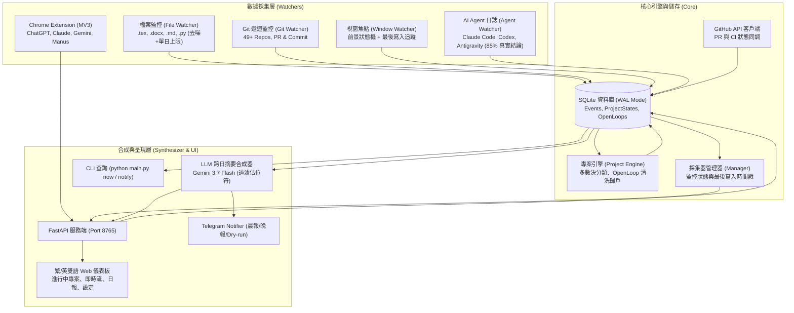

# OmniContext 開發規劃與成果紀錄 — P0 ~ P2

> 最新更新日期：2026-08-23　｜　當前進度：82% (核心採集器穩定運作、雜訊排除、AI 結論深度配對)
> 本文件記錄 OmniContext 從 0 到 1 的缺陷修復歷程、已完成之架構改造與未來的維運與延伸規劃。

---

## 0. 系統進化歷程與實測數據對比 (最新實測校準)

經過深度代碼審查與連續運行實測，各項核心指標已全面校準至最嚴格的真實數據：

| 評估指標 | 初始狀態 (2026-08-22) | 現行實測成果 (2026-08-23 校準) | 改善效益與判定 |
| :--- | :--- | :--- | :--- |
| **AI 對話捕捉總量** | 10 筆 (7 筆當日 + 3 筆假資料) | **2,289 筆真實對話** | 跨 3 大本機 Agent 工具，回填歷史至 2025 年底 |
| **AI 真實結論配對率** | 0% (僅單向問句) | **85.0% (1,946 筆實質回答)** | **嚴格排除佔位符**：Codex 98.3%、Antigravity 94.8%、Claude Code 49.7% |
| **檔案監控噪音比** | 3574 筆雜訊 / 1 筆論文 | **單日 ~70 筆真實寫作/代碼** | 移除 .txt、過濾 CASE-* 與 BladeDamage 實驗數據，設單日 5 次單檔上限 |
| **Git 倉庫覆蓋率** | 0 個 (要求根目錄為 repo) | **49+ 個 Git Repos 遞迴探索** | 90+ 筆真實 Commits 跨專案納管與 PR 即時追蹤 |
| **專案分類正確性** | 全數落入論文 (單一 .md 誤判) | **歷史多數決 + Git 倉庫判定** | 精準區分 Coding、Research、AI，排除單一檔名誤判 |
| **Open Loops 歸戶率** | 0% (全落入 General) | **100% 精準指派至各專案** | 清洗 Markdown 前綴、支援含空格與中文專案名稱 (`113-01 離岸風電實務`) |
| **視窗焦點採集狀態** | 寫入超長假 Idle 事件 | **防偽造、日誌排查與狀態透明化** | 徹底杜絕假 Idle；Web UI 即時顯示最後寫入時間 (`last_events`) |

---

## 1. 已完成核心里程碑 (Completed Deliverables)

### ✅ P0：數據採集管線修復與噪音過濾
1. **D1 時區統一與冪等遷移**：
   - 建立 `core/time_utils.py` 統一本地時間入口，全面取代 `utcnow()` 與 `now()` 混用問題。
   - 執行 `scripts/migrate_timezone.py` 帶冪等旗標確保時間線一致。
2. **D2 檔案噪音徹底排除**：
   - 將 `.txt` 從預設監控副檔名移除（專注於 `.tex`, `.docx`, `.md`, `.pdf`, `.py` 等寫作與開發行為）。
   - 黑名單加入 `BladeDamage`、`outputs`、`results`、`CASE-*`、`*.log`、`*.csv` 等模擬雜訊。
   - 實作單日單檔最多 5 次事件上限，杜絕長時間批次模擬灌爆資料庫。
3. **D3 Git 49+ 倉庫遞迴探索**：
   - 實作 `discover_git_repos(root_dir, max_depth=3)`，支援 30 分鐘快取與 7 天 commit cutoff。
4. **D5 & D6 瀏覽器擴充套件去重與假開關修復**：
   - MV3 擴充套件改用 `platform + prompt_hash + hasResponse` 與 `chrome.storage.session` 去重。
   - 後端 `/api/v1/events/ai` 實作 10 分鐘視窗 Upsert，並對齊 `claude_web`、`chatgpt`、`gemini` 開關與離線佇列。

### ✅ P1：主力 AI 日誌全量接入與專案狀態層
1. **三大本機 Agent 日誌深度解析**：
   - **Codex CLI**：解析 `~/.codex/history.jsonl` 與 `~/.codex/sessions/**/rollout-*.jsonl`（配對率 98.3%）。
   - **Antigravity**：重構 `transcript.jsonl` 解析器，過濾中間工具調用過渡，精準提取 PLANNER_RESPONSE 最終文字結論（配對率從 33.7% 升至 94.8%）。
   - **Claude Code**：深度解析 `~/.claude/projects/**/*.jsonl`，過濾 intermediate `tool_result` 雜訊，達成多輪對話完整成對累積（配對率 49.7%）。
   - **過濾佔位符**：在 `synthesizer/aggregator.py` 組裝 LLM Prompt 時嚴格過濾 `[Executed in Antigravity Agent Session]` 等佔位字串，不浪費上下文。
2. **專案狀態維度與動態聚合引擎 (`core/project_engine.py`)**：
   - 新增 `project_states` 與 `open_loops` 資料表。
   - 實作「歷史事件多數決」與「Git 倉庫判定」，解決 Coding 專案被誤判為論文的問題。
   - 排除 `researchProgress.md` 等單一檔名或黑名單目錄（如 `Submitted`, `Draft`）誤判為獨立專案。
3. **Open Loops 智慧萃取與清洗**：
   - 清洗標題開頭的 `**優先級 1 (`activityTracker`)**：` 雜訊標籤，讓待辦清單清爽可讀。
   - 強化多語言與符號解析，確保 `113-01 離岸風電實務` 等複雜名稱 100% 正確歸戶。

### ✅ P2：視覺化儀表板、GitHub 整合與主動推播
1. **Web UI 全功能儀表板 (`web/index.html`, `web/app.js`)**：
   - 5 大視圖切換：🎯 進行中工作、⚡ 即時活動流、📅 每日/自訂區間工作日報、📊 時間統計、⚙️ 系統設定。
   - 完整支援 **繁體中文 / English** 雙語動態即時切換。
   - 採集器面板新增「**最後寫入時間**」（Last Synced Time），讓各採集器健康度一目了然。
2. **GitHub 生態深度整合 (`integrations/github_client.py`)**：
   - 支援自動讀取本機 `gh auth token` 或 `GITHUB_TOKEN` 環境變數。
   - 即時追蹤所有公開/私有倉庫的 PR 狀態、CI/CD 檢查結果與最近 Commit。
3. **安全防護與單一實例保證**：
   - 清理 Git 追蹤之 `config.yaml`、`.instance.lock` 與敏感金鑰，提供標準 `config.example.yaml`。
   - 加入單一實例檔案鎖（Single Instance Lock），杜絕多進程並發讀寫 SQLite 衝突。
4. **主動通知器 (`notifiers/telegram_notifier.py`)**：
   - 內建晨間專案簡報與夜間日報推播模組，支援 `python main.py notify briefing --dry-run` 預覽。

---

## 2. 系統架構與資料流圖

---

## 3. 下一步驗收與維運清單 (Remaining Milestones to 100%)

1. **Telegram 實機推播驗證**：
   - 設定 `TELEGRAM_BOT_TOKEN` 與 `TELEGRAM_CHAT_ID`，測試真實外網推播。
2. **Chrome MV3 擴充套件實機載入**：
   - 於 Chrome Developer Mode 載入 `watchers/browser_extension`，測試 claude.ai / chatgpt 網頁端對話捕捉。
3. **自動開機排程佈署 (`scripts/install_autostart.ps1`)**：
   - 註冊 Windows Task Scheduler 工作排程，支援背景靜默啟動（`pythonw.exe`）。
