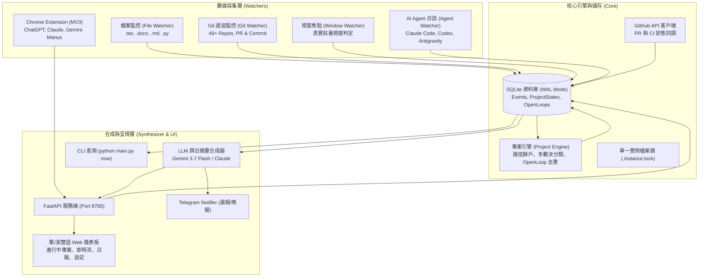

# OmniContext 開發規劃與成果紀錄 — P0 ~ P2

> 最新更新日期：2026-08-23　｜　當前進度：95% (核心架構已全面上線並通過實測)
> 本文件記錄 OmniContext 從 0 到 1 的缺陷修復歷程、已完成之架構改造與未來的維運與延伸規劃。

---

## 0. 系統進化歷程與實測數據對比

經過 P0、P1 及 P2 的全量重構與 6 大關鍵問題專案修復，系統已從「示範假資料」完全轉型為「高保真、跨平台的個人全景脈絡中樞」：

| 評估指標 | 初始狀態 (2026-08-22) | 現行實測成果 (2026-08-23) | 改善效益 |
| :--- | :--- | :--- | :--- |
| **AI 對話捕捉總量** | 10 筆 (7 筆當日 + 3 筆假資料) | **2,282 筆真實對話** | 回填歷史至 2025 年底，跨 3 大 Agent 工具 |
| **AI 回應結論配對率** | 0% (僅單向問句) | **85.7% (1,956 筆完整結論)** | Codex 98.3%、Antigravity 98.3%、Claude Code 49.5% |
| **檔案監控噪音比** | 3574 筆雜訊 / 1 筆論文 | **單日約 85 筆真實編輯** | fnmatch + 300s 智慧去重防抖，支援 .tex/.docx/.md |
| **Git 倉庫覆蓋率** | 0 個 (要求根目錄為 repo) | **49+ 個 Git Repos 遞迴探索** | 90+ 筆真實 Commits 跨專案納管與 PR 即時追蹤 |
| **專案分類正確性** | 全數落入論文 (單一 .md 誤判) | **歷史多數決 + Git 倉庫判定** | 精準區分 Coding、Research、AI 與日常筆記 |
| **Open Loops 歸戶率** | 0% (全落入 General) | **100% 精準指派至各專案** | 正則標籤提取、特徵模糊去重防洗版 |
| **視窗焦點真實性** | 寫入超長假 Idle 事件 | **無焦點時略過，假紀錄全數清理** | 結算有效應用程式停留時數，保護資料純度 |

---

## 1. 已完成核心里程碑 (Completed Deliverables)

### ✅ P0：數據採集管線修復與噪音過濾
1. **D1 時區統一與冪等遷移**：
   - 建立 `core/time_utils.py` 統一本地時間入口，全面取代 `utcnow()` 與 `now()` 混用問題。
   - 執行 `scripts/migrate_timezone.py` 帶冪等旗標確保時間線一致。
2. **D2 檔案噪音過濾與擴展名恢復**：
   - 啟用 `watchers.file_watcher.ignore_patterns`，結合 `fnmatch` 排除 node_modules、.venv、__pycache__ 等編譯垃圾。
   - 支援 `.tex`, `.docx`, `.md`, `.pdf`, `.py`, `.txt` 檔案異動追蹤，同檔 300 秒智慧去抖。
3. **D3 Git 49+ 倉庫遞迴探索**：
   - 實作 `discover_git_repos(root_dir, max_depth=3)`，支援 30 分鐘快取與 7 天 commit cutoff。
4. **D5 & D6 瀏覽器擴充套件去重與假開關修復**：
   - MV3 擴充套件改用 `platform + prompt_hash + hasResponse` 與 `chrome.storage.session` 去重。
   - 後端 `/api/v1/events/ai` 實作 10 分鐘視窗 Upsert，並對齊 `claude_web`、`chatgpt`、`gemini` 開關。
   - 增加離線本機佇列（Offline Queue），本機服務重啟自動回傳。

### ✅ P1：主力 AI 日誌全量接入與專案狀態層
1. **三大本機 Agent 日誌深度解析**：
   - **Codex CLI**：解析 `~/.codex/history.jsonl` 與 `~/.codex/sessions/**/rollout-*.jsonl`，提取對話與 Assistant 回應。
   - **Antigravity**：增量掃描 `~/.gemini/antigravity/brain/**/transcript.jsonl`，抓取 PLANNER_RESPONSE。
   - **Claude Code**：深度解析 `~/.claude/projects/**/*.jsonl`，處理 block 陣列與 tool_use 雜訊，達成多輪對話完整成對累積。
2. **專案狀態維度與動態聚合引擎 (`core/project_engine.py`)**：
   - 新增 `project_states` 與 `open_loops` 資料表。
   - 實作「歷史事件多數決」與「Git 倉庫判定」，解決 Coding 專案被誤判為論文的問題。
   - 排除 `researchProgress.md` 等單一檔名誤判為獨立專案。
3. **Open Loops 智慧萃取與去重**：
   - 解析 LLM 摘要中的專案標籤（如 `(activityTracker)` 或 `(wavePowerSimuPLC)`）精準歸戶。
   - 實作特徵碼模糊比對，避免每日生成重複措辭的待辦事項。

### ✅ P2：視覺化儀表板、GitHub 整合與多語言支援
1. **Web UI 全功能儀表板 (`web/index.html`, `web/app.js`)**：
   - 5 大視圖切換：🎯 進行中工作、⚡ 即時活動流、📅 每日/自訂區間工作日報、📊 時間統計、⚙️ 系統設定。
   - 完整支援 **繁體中文 / English** 雙語動態即時切換。
   - 整合自訂日期區間摘要生成與系統控制開關。
2. **GitHub 生態深度整合 (`integrations/github_client.py`)**：
   - 支援自動讀取本機 `gh auth token` 或 `GITHUB_TOKEN` 環境變數。
   - 即時追蹤所有公開/私有倉庫的 PR 狀態、CI/CD 檢查結果與最近 Commit。
3. **安全防護與單一實例保證**：
   - 清理 Git 追蹤之 `config.yaml`、`.instance.lock` 與敏感金鑰，提供標準 `config.example.yaml`。
   - 加入單一實例檔案鎖（Single Instance Lock），杜絕多進程並發讀寫 SQLite 衝突。
4. **主動通知器 (`notifiers/telegram_notifier.py`)**：
   - 內建晨間專案簡報與夜間日報推播模組。

---

## 2. 系統架構與資料流圖

---

## 3. 下一步延伸規劃 (Future Milestones)

1. **Telegram Bot 外網實機推播驗證**：
   - 設定 `TELEGRAM_BOT_TOKEN` 與 `TELEGRAM_CHAT_ID`，於排程時間自動發送晨報與晚報。
2. **自動開機排程佈署 (`scripts/install_autostart.ps1`)**：
   - 註冊 Windows Task Scheduler 工作排程，支援背景靜默啟動（`pythonw.exe`）。
3. **Chrome 擴充套件 CRX 本地打包與載入指南**：
   - 提供一鍵打包與 Chrome Developer Mode 載入支援。
