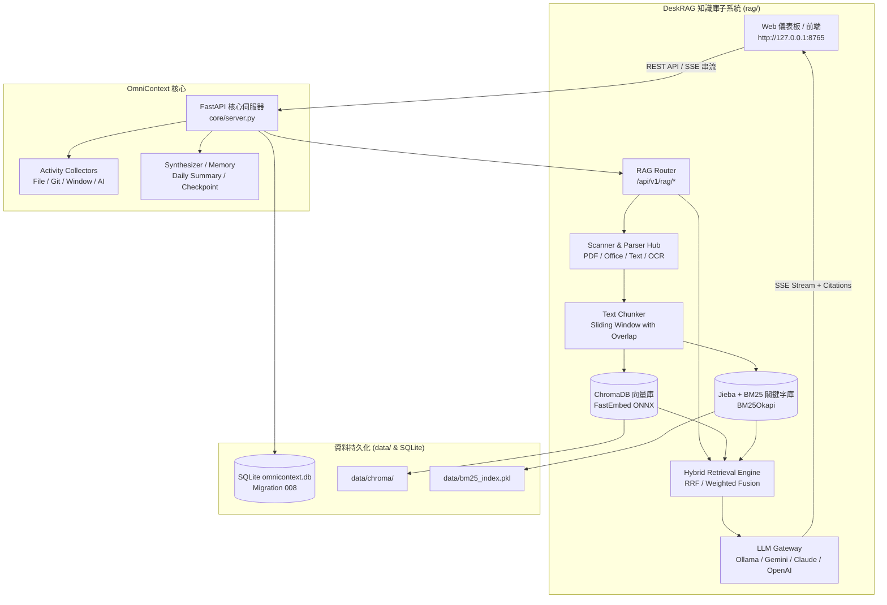

# DeskRAG 與 activityTracker (OmniContext) 單一伺服器整合完成報告

本專案已成功將 `deskRAG` 本地知識庫與 RAG 對話問答系統**無縫整合**至 `activityTracker`（OmniContext），達成**單一伺服器（Single Server）架構**，無需啟動兩個獨立服務或多個連接埠。

---

## 🏗️ 整合架構與核心模組



---

## 🧩 各階段實作成果

### 1. 設定與依賴整併
- `requirements.txt` & `pyproject.toml`：加入 `chromadb`, `fastembed`, `rank_bm25`, `jieba`, `pymupdf`, `python-docx`, `python-pptx`, `openpyxl`, `pandas`，並註冊 `rag*` 模組套件。
- `config.example.yaml` & `config.yaml`：新增 `rag` 配置區塊（向量庫路徑、BM25 索引檔路徑、切片大小、預設檢索演算法與權重）。

### 2. 資料庫模型與自動遷移 (Migration 008)
- `core/models.py`：新增 4 個 SQLAlchemy ORM 模型：
  - `RAGIndexedFolder`：監控與索引目錄。
  - `RAGIndexedFile`：檔案中繼資料、切片數與 MD5 增量比對。
  - `RAGChatSession`：RAG 問答對話階段。
  - `RAGChatMessage`：對話記錄、角色與引文切片 JSON 快照。
- `core/migrations.py`：新增 `_migration_008_rag_tables`，保證資料庫結構自動升級與等冪性。

### 3. RAG 核心子系統 (`rag/`)
- **多格式解析器 (`rag/parsers/`)**：
  - `PdfParser`：以 PyMuPDF 為核心的高精確度 PDF 頁面擷取（自動保留 page 標籤）。
  - `DocxParser`、`PptxParser`、`ExcelParser`：解析 Word 段落、PowerPoint 投影片、Excel 表格。
  - `TextParser`：支援 Markdown、原始碼（.py, .js, .ts, .json 等），具備多編碼自動探測。
  - `ParserHub`：自動根據副檔名派發對應解析器。
- **階層切分器 (`rag/chunker.py`)**：支援滑動窗口（Sliding Window with Overlap），保留所有段落標題、頁碼、投影片與工作表 metadata。
- **向量化與向量庫 (`rag/embeddings.py`, `rag/vector_store.py`)**：
  - FastEmbed (`BAAI/bge-small-zh-v1.5` / `bge-small-en-v1.5`) 本地極速 ONNX 推論，兼具 Ollama / OpenAI 擴充介面。
  - 本地 ChromaDB 向量庫持久化，支援 Cosine Similarity 轉換與單檔增量清除。
- **BM25 關鍵字索引 (`rag/retriever.py`)**：結合 Jieba 繁簡中文分詞與 BM25Okapi 演算法，支援 Pickle 序列化快取。
- **多策略檢索器 (`rag/retrieval/`)**：
  - `HybridRRFRetriever`：倒數排名融合（Reciprocal Rank Fusion），綜合向量語義與精準關鍵詞。
  - `WeightedFusionRetriever`：線性加權融合（可依 alpha 權重動態微調）。
  - `VectorRetriever` / `BM25Retriever`：單一維度檢索。
  - `RetrieverRegistry`：動態策略註冊與 Prompt 引文格式化。
- **目錄掃描與增量索引 (`rag/scanner.py`)**：非同步背景批次掃描，支援檔案 MD5 比對（跳過未修改檔案）、刪除失效檔案向量、即時廣播進度。
- **多模型 LLM 網關 (`rag/llm_gateway.py`)**：統一調度 Ollama、Gemini、Claude、OpenAI，支援 SSE (Server-Sent Events) 逐字串流輸出，自動對接系統環境變數金鑰。

### 4. REST API & SSE 路由 (`rag/router.py`)
- `GET/POST/DELETE /api/v1/rag/folders`：知識庫目錄 CRUD。
- `POST /api/v1/rag/scan` & `GET /api/v1/rag/progress`：即時掃描與進度輪詢。
- `GET /api/v1/rag/files` & `POST /api/v1/rag/open-file`：檔案查詢與**直接在 Windows 檔案總管反白開啟該檔案**。
- `GET/POST/DELETE /api/v1/rag/chat/sessions` & `messages`：對話階段與歷史管理。
- `POST /api/v1/rag/chat`：SSE 串流問答介面（推送 `event: citations` 引文卡片與 `event: message` token 串流）。

### 5. Web UI 整合 (`web/`)
- `web/index.html`：新增 `03 · 📚 知識庫與 RAG` 專屬分頁，左側為「目錄管理與索引檔案清單」，右側為「多模型智慧對話與引文互動卡片」。
- `web/app.js`：實作資料夾新增/刪除、即時索引進度條動態更新、SSE 串流解碼、Session 歷程切換、跨平台 i18n 繁中/英文切換。
- `web/style.css`：打造符合火影橘與暗色/淺色主題的高質感聊天氣泡、引用來源卡片（包含檔名、頁數、段落、比對分數標籤）與文字打字游標動畫。

---

## 🧪 測試與驗證結果

已執行完整測試套件，包含 4 組新 RAG 單元與整合測試，以及原有 20 組 OmniContext 測試：

```bash
$ python -m pytest tests/ -v
====================== 100 passed, 4 warnings in 34.26s =======================
```

| 測試檔案 | 測試項目 | 結果 |
|---|---|---|
| `tests/test_rag_parsers.py` | Markdown, Docx, Excel, Pptx 多格式解析 | ✅ PASS (4/4) |
| `tests/test_rag_chunker.py` | 滑動窗口切分、重疊率、Metadata 完整性 | ✅ PASS (2/2) |
| `tests/test_rag_retrieval.py` | BM25 關鍵字索引、Prompt 格式化、Registry 註冊 | ✅ PASS (2/2) |
| `tests/test_rag_api.py` | 策略列表、進度查詢、目錄生命週期、對話 CRUD | ✅ PASS (4/4) |
| `tests/test_database_migration.py` | 遷移 008 等冪性、資料結構與回滾保護 | ✅ PASS (7/7) |
| `tests/test_api_boundary.py` 等其他 19 個測試 | OmniContext 原有核心功能無回歸 | ✅ PASS (81/81) |
| **總計** | **全專案單元與整合測試** | **✅ 100/100 PASS** |

---

## 🚀 使用指南

1. **啟動 OmniContext 單一服務**：
   ```bash
   python main.py
   # 或
   python -m core.server
   ```
2. **開啟瀏覽器儀表板**：
   開啟 `http://127.0.0.1:8765`，點選頂部導航欄中的 **`03 · 📚 知識庫與 RAG`**。
3. **加入知識庫目錄並掃描**：
   - 在左欄輸入本機路徑（例如：`D:\MyProject\Docs`），點選「+ 加入」。
   - 點選「⚡ 掃描索引」，進度條將即時顯示檔案處理與切片建立進度。
4. **與文件智慧對話**：
   - 選擇使用的 AI 模型（Ollama 本機離線、Gemini、Claude、OpenAI）。
   - 選擇檢索演算法（Hybrid RRF / Weighted Fusion / Vector Only / BM25 Only）。
   - 輸入問題並發送，系統將以 SSE 即時串流回答，並在下方列出引文出處（附頁碼、相關度與「📂 在總管開啟」按鈕）。
